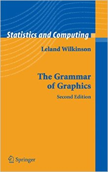
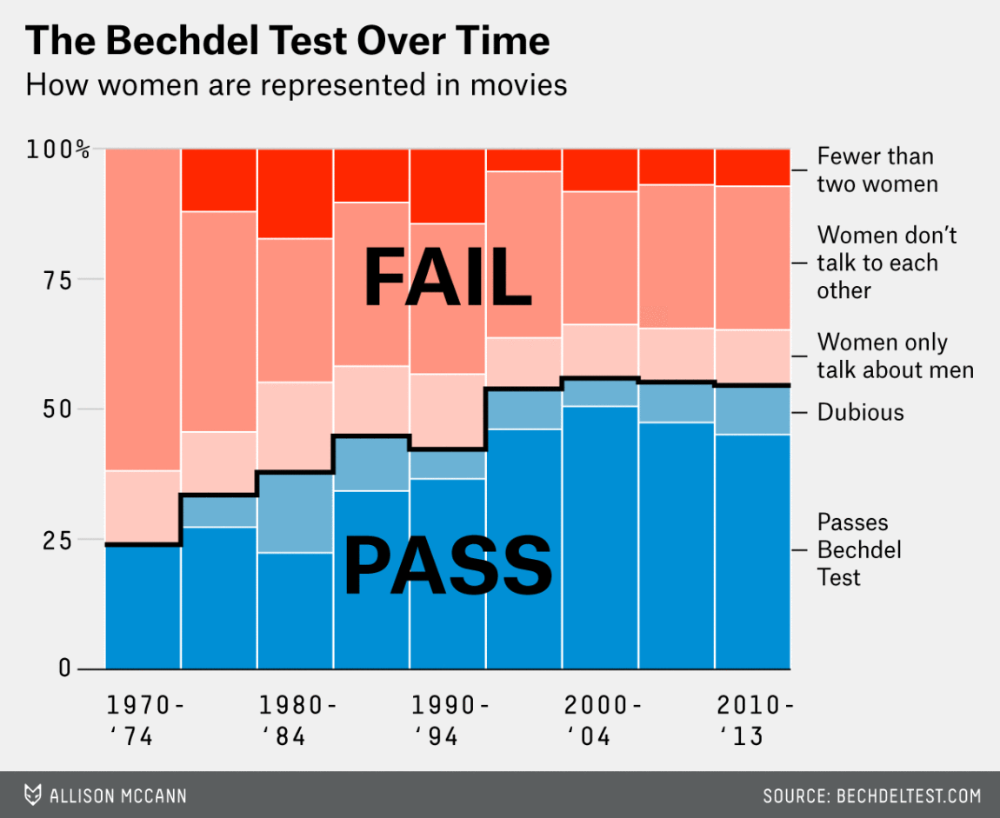

```{r include=FALSE}
#options(servr.daemon = TRUE)
library(tidyverse)
library(mosaic)
library(stringr)
library(okcupiddata)
library(knitr)
do <- mosaic::do
filter <- dplyr::filter
knitr::opts_chunk$set(warning=FALSE, message=FALSE, fig.width=9.5, fig.height=4.5, comment=NA, rows.print=16)
theme_set(theme_gray(base_size = 24))
```


## Important R ideas for students to know ASAP

Vector/variable
  - Type of vector (`int`, `num`, `chr`, `logical`, `date`)

--

Data frame
  - Vectors of (potentially) different types
  - Each vector has the same number of rows
  
---

class: center, middle  
  
# Welcome to the [tidyverse](https://blog.rstudio.org/2016/09/15/tidyverse-1-0-0/)!
  
The `tidyverse` is a collection of R packages that share common philosophies and are designed to work together. <br><br> 
  
<a href="http://tidyverse.tidyverse.org/logo.png"></a>

---

# Chapter 3: Tidy Data?


1. Each variable forms a column.
2. Each observation forms a row.
3. Each type of observational unit forms a table.

The third point means we don't mix apples and oranges.

---

## What is Tidy Data?

1. Each observation forms a row. In other words, each row corresponds to a single instance of an <u>observational unit</u>
1. Each variable forms a column:
    + Some variables may be used to identify the <u>observational units</u>. 
    + For organizational purposes, it's generally better to put these in the left-hand columns
1. Each type of observational unit forms a table.

---

## Differentiating between <u>neat</u> data and <u>tidy</u> data

- Colloquially, they mean the same thing
- But in our context, one is a subset of the other. 

<br>

<u>Neat</u> data is 
  - easy to look at, 
  - organized nicely, and 
  - in table form.

--

<u>Tidy</u> data is neat but also abides by a set of three rules.

---

class: center, middle

<a href="figure/lebowski-abides-o.gif"></a>


---

## Is this tidy?

```{r echo=FALSE, message=FALSE, warning=FALSE}
library(fivethirtyeight)
library(tidyverse)
set.seed(2)
bechdel %>% sample_n(12) %>%
  select(year, title, clean_test, budget_2013) %>%
  arrange(title)
```


---

name: demscore

## How about this? Is this tidy?

```{r echo=FALSE, message=FALSE, warning=FALSE}
dem_score <- read_csv("data/dem_score.csv")
dem_score %>% slice(1:12)
```

<small><small>[Why is tidy data important?](#whytidy) slide</small></small>

---

## Beginning steps

Frequently the first thing to do when given a dataset is to

- check that the data is <u>tidy</u>,
- identify the observational unit,
- specify the variables, and
- give the types of variables you are presented with.

This will help with 

- choosing the appropriate plot, 
- summarizing the data, and 
- understanding which inferences can be applied.

---

class: center, middle

# Chapter 4: Data Viz

<a href="http://gitsense.github.io/images/wealth.gif"></a>

Inspired by [Hans Rosling](https://www.youtube.com/watch?v=jbkSRLYSojo)

---

```{r echo=FALSE,fig.height=6, fig.width=10, fig.align='center'}
library(gapminder)
options(scipen = 99)
#gap_with_colors <-
#  data.frame(gapminder,
#             cc = I(country_colors[match(gapminder$country,
#                                         names(country_colors))]))

gapminder %>% filter(year == 1992) %>%
  ggplot(aes(x = log(gdpPercap, base = 10), y = lifeExp, color = continent,
             size = pop)) +
  geom_point() + xlab('Gross Domestic Product (log scale)') + ylab('Life Expectancy at birth (years)') + ggtitle("Gapminder for 1992")

#+
#  scale_color_manual(values = gapminder::continent_colors)
```


- What are the variables here?
- What is the observational unit? 
  - I.e., what variable (or combination of variables) makes the row unique?
  - Or what is the THING being measured?
- How are the variables mapped to aesthetics?

---

class: center, middle

## Grammar of Graphics

Wilkinson (2005) laid out the proposed <br> "Grammar of Graphics"

<br>

<a href="http://www.powells.com/book/the-grammar-of-graphics-9780387245447"></a>

---

class: center, middle

## Grammar of Graphics in R

Wickham implemented the grammar in R <br> in the `ggplot2` package

<br>

<a href="http://www.powells.com/book/ggplot2-elegant-graphics-for-data-analysis-9783319242750/68-428"></a>

---

class: center, middle

## What is a statistical graphic?

--

## A `mapping` of <br> `data` variables

--

## to <br> `aes()`thetic attributes

--

## of <br> `geom_`etric objects.

---

class: inverse, center, middle

## Back to basics

---

### Consider the following data in tidy format:

```{r echo=FALSE}
simple_ex <-
  data_frame(
    A = c(1980, 1990, 2000, 2010),
    B = c(1, 2, 3, 4),
    C = c(3, 2, 1, 2),
    D = c("low", "low", "high", "high")
  )
simple_ex
```

<!-- Copy to chalkboard/whiteboard -->

- Sketch the graphics below on paper, where the `x`-axis is variable `A` and the `y`-axis is variable `B`

1. <small>A scatter plot</small>
1. <small>A scatter plot where the `color` of the points corresponds to `D`</small>
1. <small>A scatter plot where the `size` of the points corresponds to `C`</small>
1. <small>A line graph</small>
1. <small>A line graph where the `color` of the line corresponds to `D` with points added that are all green of size 4.</small>

---

## Reproducing the plots in <small>`ggplot2`</small>

### 1. A scatterplot

```{r, eval=FALSE}
library(ggplot2)
ggplot(data = simple_ex, mapping = aes(x = A, y = B)) + 
  geom_point()
```
--

```{r, echo=FALSE, fig.height=4.5}
ggplot(data = simple_ex, aes(x = A, y = B)) + 
  geom_point()
```


---


## Reproducing the plots in <small>`ggplot2`</small>

### 2. A scatter plot where the `color` of the points corresponds to `D`

```{r, eval=FALSE}
library(ggplot2)
ggplot(data = simple_ex, mapping = aes(x = A, y = B)) + 
  geom_point(mapping = aes(color = D))
```
--

```{r, echo=FALSE, fig.height=4.5}
ggplot(data = simple_ex, mapping = aes(x = A, y = B)) + 
  geom_point(mapping = aes(color = D))
```


---

## Reproducing the plots in <small>`ggplot2`</small>

### 3. A scatter plot where the `size` of the points corresponds to `C`

```{r, eval=FALSE}
library(ggplot2)
ggplot(data = simple_ex, mapping = aes(x = A, y = B, size = C)) + 
  geom_point()
```
--

```{r, echo=FALSE, fig.height=4.5}
ggplot(data = simple_ex, mapping = aes(x = A, y = B, size = C)) + 
  geom_point()
```


---

## Reproducing the plots in <small>`ggplot2`</small>

### 4. A line graph

```{r, eval=FALSE}
library(ggplot2)
ggplot(data = simple_ex, mapping = aes(x = A, y = B)) + 
  geom_line()
```
--

```{r, echo=FALSE, fig.height=4.5}
ggplot(data = simple_ex, aes(x = A, y = B)) + 
  geom_line()
```


---

## Reproducing the plots in <small>`ggplot2`</small>

### 5. A line graph where the `color` of the line corresponds to `D` with points added that are all blue of size 4.

```{r, eval=FALSE}
library(ggplot2)
ggplot(data = simple_ex, mapping = aes(x = A, y = B)) + 
  geom_line(mapping = aes(color = D)) +
  geom_point(color = "blue", size = 4)
```
--

```{r, echo=FALSE, fig.height=4}
ggplot(data = simple_ex, mapping = aes(x = A, y = B)) + 
  geom_line(mapping = aes(color = D)) +
  geom_point(color = "blue", size = 4)
```

---

name: whytidy

## Why is tidy data important?

- Think about trying to plot democracy score across years in the simplest way possible with the data on the [Is this tidy? slide](#demscore).
--

- It would be much easier if the data looked like what follows instead so we could put 
    - `year` on the `x`-axis and 
    - `dem_score` on the `y`-axis.

---

## Tidy is good

```{r echo=FALSE}
dem_score_tidy <- dem_score %>% 
  gather(-country, key = "year", value = "dem_score") %>% 
  mutate(year = as.numeric(year)) 
set.seed(2)
dem_score_tidy %>% sample_n(13) %>% arrange(country)
```

---

## Let's plot it

- Plot the line graph for 4 countries using `ggplot`

```{r}
dem_score4 <- dem_score_tidy %>%
  filter(country %in% c("Australia", "Pakistan", "Portugal", "Uruguay"))
ggplot(data = dem_score4, mapping = aes(x = year, y = dem_score)) +
  geom_line(mapping = aes(color = country))
```

---

# The Five-Named Graphs 

## The 5NG of data viz

- Scatterplot: `geom_point()`
- Line graph: `geom_line()`
--

- Histogram: `geom_histogram()`
- Boxplot: `geom_boxplot()`
- Bar graph: `geom_bar()`


---

class: center, middle

## More examples

---

## Histogram

```{r fig.height=5.5}
library(nycflights13)
ggplot(data = weather, mapping = aes(x = humid)) +
  geom_histogram(bins = 20, color = "black", fill = "darkorange")
```

---

## Boxplot (broken)

```{r fig.height=5.5}
library(nycflights13)
ggplot(data = weather, mapping = aes(x = month, y = humid)) +
  geom_boxplot()
```

---


## Boxplot (fixed)

```{r fig.height=5.5}
library(nycflights13)
ggplot(data = weather, mapping = aes(x = factor(month), y = humid)) +
  geom_boxplot()
```

---

## Bar graph

```{r}
library(fivethirtyeight)
ggplot(data = bechdel, mapping = aes(x = clean_test)) +
  geom_bar()
```

---

## How about over time?

- Hop into `dplyr`

```{r}
library(dplyr)
year_bins <- c("'70-'74", "'75-'79", "'80-'84", "'85-'89",
               "'90-'94", "'95-'99", "'00-'04", "'05-'09",
               "'10-'13")
bechdel <- bechdel %>%
  mutate(five_year = cut(year, 
                         breaks = seq(1969, 2014, 5), 
                         labels = year_bins)) %>% 
  mutate(clean_test = factor(clean_test, 
                             levels = c("nowomen", "notalk", "men",
                                        "dubious", "ok")))
```

---

## How about over time? (Stacked)

```{r fig.width=11}
library(fivethirtyeight)
library(ggplot2)
ggplot(data = bechdel,
       mapping = aes(x = five_year, fill = clean_test)) +
  geom_bar()
```

---

## How about over time? (Side-by-side)

```{r fig.width=11}
library(fivethirtyeight)
library(ggplot2)
ggplot(data = bechdel,
       mapping = aes(x = five_year, fill = clean_test)) +
  geom_bar(position = "dodge")
```

---

## How about over time? (Stacked proportional)

```{r fig.width=11}
library(fivethirtyeight)
library(ggplot2)
ggplot(data = bechdel,
       mapping = aes(x = five_year, fill = clean_test)) +
  geom_bar(position = "fill", color = "black")
```

---

class: center, middle

## `ggplot2` is for beginners and for data science professionals!

<a href="https://fivethirtyeight.com/features/the-dollar-and-cents-case-against-hollywoods-exclusion-of-women/"></a>

---

## Practice

Produce appropriate 5NG with R package & data set in [ ], e.g., [`nycflights13` $\rightarrow$ `weather`] 

<!--
Try to look through the help documentation/Google to improve your plots
-->

1. Does `age` predict `recline_rude`? <br> [`fivethirtyeight` $\rightarrow$ `na.omit(flying)`]

2. Distribution of `age` by `sex` <br> [`okcupiddata` $\rightarrow$ `profiles`]

3. Does `budget` predict `rating`? <br> [`ggplot2movies` $\rightarrow$ `movies`]

4. Distribution of log base 10 scale of `budget_2013` <br> [`fivethirtyeight` $\rightarrow$ `bechdel`]

---

### HINTS

```{r echo=FALSE, fig.height=7, fig.width=10.5}
library(gridExtra)
library(fivethirtyeight)
library(ggplot2movies)
library(okcupiddata)

p1 <- ggplot(data = na.omit(flying), mapping = aes(fill = recline_rude, x = age)) + geom_bar(position = "fill") + ggtitle("Problem 1") + theme_gray(base_size = 20)

p2 <- ggplot(data = profiles, mapping = aes(x = sex, y = age)) +
  geom_boxplot() + ggtitle("Problem 2") + theme_gray(base_size = 20)

p3 <- ggplot(data = movies, mapping = aes(x = budget, y = rating)) +
  geom_point() + ggtitle("Problem 3") + theme_gray(base_size = 20)

p4 <- ggplot(data = bechdel, mapping = aes(x = log(budget_2013, 10))) +
  geom_histogram(color = "white", bins = 10) + ggtitle("Problem 4") +
  theme_gray(base_size = 20)

grid.arrange(p1, p2, p3, p4, ncol = 2, padding = unit(0.5, "line"),
             widths = c(2.6, 1.4))

```


---

class: inverse, center, middle

# DEMO in RStudio

---

class: center, middle

### Determining the appropriate plot

<a href="https://coggle.it/diagram/V_G2gzukTDoQ-aZt"></a>

---

class: center, middle

# Chapter 5: Data Wrangling

---

### `gapminder` data frame in the `gapminder` package

```{r rows.print=15}
library(gapminder)
gapminder
```

---

## Base R versus the `tidyverse`

Say we wanted mean life expectancy across all years for Asia
--

```{r}
# Base R
asia <- gapminder[gapminder$continent == "Asia", ]
mean(asia$lifeExp)
```
--
 
```{r}
library(dplyr)
gapminder %>% filter(continent == "Asia") %>%
  summarize(mean_exp = mean(lifeExp))
```

---

## The pipe `%>%`

`r knitr::include_graphics("figure/pipe.png")` &emsp; &emsp;`r knitr::include_graphics("figure/MagrittePipe.jpg")`
--

- A way to chain together commands
--

- It is *essentially* the `dplyr` equivalent to the <br> `+` in `ggplot2`

---

## The 5NG of data viz
--

### `geom_point()`<br> `geom_line()` <br> `geom_histogram()`<br>  `geom_boxplot()`<br> `geom_bar()`

---

# The Five Main Verbs (5MV) of data wrangling

### `filter()` <br> `summarize()` <br> `group_by()` <br> `mutate()` <br> `arrange()`

---

## `filter()`

- Select a subset of the rows of a data frame. 

- The arguments are the "filters" that you'd like to apply.
--

```{r}
library(gapminder); library(dplyr)
gap_2007 <- gapminder %>% filter(year == 2007)
head(gap_2007)
```

- Use `==` to compare a variable to a value

---

## Logical operators

- Use `|` to check for any in multiple filters being true:
--

```{r eval=FALSE}
gapminder %>% 
  filter(year == 2002 | continent == "Europe")
```
--

```{r echo=FALSE}
gapminder %>% 
  filter(year == 2002 | continent == "Europe")
```

---

## Logical operators

- Use `&` or `,` to check for all of multiple filters being true:
--

```{r eval=FALSE}
gapminder %>% 
  filter(year == 2002, continent == "Europe")
```

```{r echo=FALSE}
gapminder %>% 
  filter(year == 2002, continent == "Europe")
```

---

## Logical operators

- Use `%in%` to check for any being true <br> (shortcut to using `|` repeatedly with `==`)
--

```{r eval=FALSE}
gapminder %>% 
  filter(country %in% c("Argentina", "Belgium", "Mexico"),
         year %in% c(1987, 1992))
```
--

```{r echo=FALSE}
gapminder %>% 
  filter(country %in% c("Argentina", "Belgium", "Mexico"),
         year %in% c(1987, 1992))
```


---

## `summarize()`

- Any numerical summary that you want to apply to a column of a data frame is specified within `summarize()`.

```{r eval=FALSE}
max_exp_1997 <- gapminder %>% 
  filter(year == 1997) %>% 
  summarize(max_exp = max(lifeExp))
max_exp_1997
```
--

```{r echo=FALSE}
max_exp_1997 <- gapminder %>% 
  filter(year == 1997) %>% 
  summarize(max_exp = max(lifeExp))
max_exp_1997
```


---

### Combining `summarize()` with `group_by()`

When you'd like to determine a numerical summary for all
levels of a different categorical variable

```{r eval=FALSE}
max_exp_1997_by_cont <- gapminder %>% 
  filter(year == 1997) %>% 
  group_by(continent) %>%
  summarize(max_exp = max(lifeExp),
            sd_exp = sd(lifeExp))
max_exp_1997_by_cont
```

--
```{r echo=FALSE}
max_exp_1997_by_cont <- gapminder %>% 
  filter(year == 1997) %>% 
  group_by(continent) %>%
  summarize(max_exp = max(lifeExp),
            sd_exp = sd(lifeExp))
max_exp_1997_by_cont
```

---

## `ggplot2` revisited

For aggregated data, use `geom_col`.  (A dynamite plot is also shown.)

```{r fig.height=3}
ggplot(data = max_exp_1997_by_cont, 
       mapping = aes(x = continent, y = max_exp)) +
  geom_col(fill = "red") +
  geom_errorbar(mapping = aes(ymin = max_exp - sd_exp,
                              ymax = max_exp + sd_exp), 
                color = "blue", width = 0.2)
```

---


## The 5MV

- `filter()`
- `summarize()`
- `group_by()`

--

- `mutate()`

--

- `arrange()`

---

## `mutate()`

- Allows you to 
    1. <font color="blue">create a new variable with a specific value</font> OR
    2. create a new variable based on other variables OR
    3. change the contents of an existing variable

--

```{r}
gap_plus <- gapminder %>% mutate(just_one = 1)
head(gap_plus)
```

---

## `mutate()`

- Allows you to 
    1. create a new variable with a specific value OR
    2. <font color="blue">create a new variable based on other variables</font> OR
    3. change the contents of an existing variable

--

```{r}
gap_w_gdp <- gapminder %>% mutate(gdp = pop * gdpPercap)
head(gap_w_gdp)
```

---

## `mutate()`

- Allows you to 
    1. create a new variable with a specific value OR
    2. create a new variable based on other variables OR
    3. <font color="blue">change the contents of an existing variable</font>

--

```{r}
gap_weird <- gapminder %>% mutate(pop = pop + 1000)
head(gap_weird)
```

---

## `arrange()`

- Reorders the rows in a data frame based on the values of one or more variables
--

```{r}
gapminder %>%
  arrange(year, country)
```

---

## `arrange()`

- Can also put into descending order
--

```{r desc}
gapminder %>%
  filter(year > 2000) %>%
  arrange(desc(lifeExp)) %>%
  head(10)
```

---

## Don't mix up `arrange` and `group_by`

- `group_by` is used (mostly) with `summarize` to calculate summaries over groups

- `arrange` is used for sorting

---

## Don't mix up `arrange` and `group_by`

This doesn't really do anything useful

```{r rows.print=10}
gapminder %>% group_by(year)
```

---

## Don't mix up `arrange` and `group_by`

But this does

```{r rows.print=10}
gapminder %>% arrange(year)
```

---

## Changing of observation unit

True or False

> Each of `filter`, `mutate`, and `arrange` change the observational unit.

--

True or False

> `group_by() %>% summarize()` changes the observational unit.

<!-- 
Draw diagram for average monthly temp aggregated like on rstudio::conf slides
-->

---


## Practice

Use the 5MV to answer problems from R data packages, e.g., [`nycflights13` $\rightarrow$ `weather`] 

<!--
Lay out what the resulting table should look like on paper first.
-->

1. What is the maximum arrival delay for each carrier departing JFK? [`nycflights13` $\rightarrow$ `flights`]

2. Calculate the domestic return on investment for 2013 scaled data descending by ROI <br> [`fivethirtyeight` $\rightarrow$ `bechdel`]

---


class: inverse, center, middle

# DEMO in RStudio

---

class: middle

# Thanks for attending!

- [Workshop Feedback Form](https://goo.gl/forms/EOEYWAd8jg04QVf72)
- Email us if you'd like to chat further during USCOTS or later
    - [chester@moderndive.com](mailto:chester@moderndive.com) / [albert@moderndive.com](mailto:albert@moderndive.com)
- [Source code for ModernDive](https://github.com/ismayc/moderndiver-book)
    - Feel free to modify the book as you wish for your own needs! Just please list the authors as "Chester Ismay, Albert Y. Kim, and YOU!"
- These slides available [here](http://bit.ly/uscots2017-slides)
- Slides created via the R package [xaringan](https://github.com/yihui/xaringan) by Yihui Xie
- Source code for these slides at <https://github.com/ismayc/moderndive-workshops>