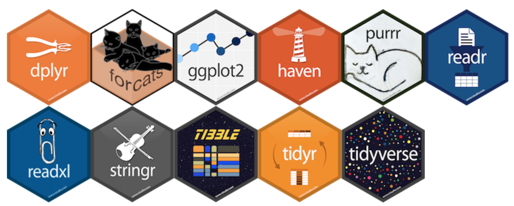
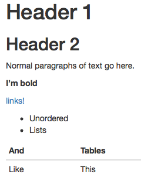

<!-- Write slide link on whiteboard -->

```{r include=FALSE}
#options(servr.daemon = TRUE)
library(tidyverse)
library(mosaic)
library(stringr)
library(okcupiddata)
library(knitr)
library(babynames)
do <- mosaic::do
filter <- dplyr::filter
knitr::opts_chunk$set(warning=FALSE, message=FALSE, fig.width=9.5, fig.height=4.5, comment=NA, rows.print=16)
theme_set(theme_gray(base_size = 24))
```

<!----------------------------------------------------------------------------->
# Introduction

## Who We Are

* [Chester Ismay](https://ismayc.github.io/): Reed College & Pacific University
    + Email: <chester.ismay@gmail.com>
    + GitHub: [`ismayc`](https://github.com/ismayc)
    + Twitter: [`@old_man_chester`](https://twitter.com/old_man_chester)
* [Albert Y. Kim](http://rudeboybert.github.io/): Middlebury College
    + Email: <albert.ys.kim@gmail.com>
    + GitHub: [`rudeboybert`](https://github.com/rudeboybert)
    + Twitter: [`@rudeboybert`](https://twitter.com/rudeboybert)

---

class: center, middle

## Outline of Workshop

[Google Doc at <http://bit.ly/uscots17-agenda>](https://docs.google.com/document/d/12Ai7wxK5OTrIwwrSJQewXHcqpMJ09lB-HkGN3BbShy4/edit?usp=sharing)


---

## Our Textbook


* *An Introduction to Statistical and Data Sciences via R*
* Webpage: <http://moderndive.com>. [GitHub Repo](https://github.com/ismayc/moderndiver-book)
* In you haven't already, please [signup](http://moderndive.us15.list-manage2.com/subscribe?u=87888fab720da90906427a5be&id=0c9e2d1df2) for our mailing list!


---

## Albert's Course (Intro to Statistical & Data Sciences)

Available in the supplementary HTML document [here](https://ismayc.github.io/moderndive-workshops/slides/slide_document.html#introduction).

* [Webpage](https://rudeboybert.github.io/MATH116/) and [GitHub Repo](https://github.com/rudeboybert/MATH116)
* Administrative:
    + Chief non-econ/bio stats service class at Middlebury
    + 12 weeks each with 3h "lecture" + 1h "lab"
    + <u>No prerequisites</u>
* Students:
    + ~24 students/section of all years/backgrounds. Only stats class many will take
    + Background: Many had AP stats, some with programming
    + All had laptops that they brought everyday
* [Topic List](https://rudeboybert.github.io/MATH116/)
    + <u>First half is data science</u>: data visualization, manipulation, importing
    + <u>Second half is intro stats</u>: sampling, hypothesis tests, CI, regression
* Evaluation
    + 10%: weekly problem sets
    + 10%: engagement
    + 45%: 3 midterms (last during finals week)
    + <u>35%: [Final projects](https://rudeboybert.github.io/MATH116/PS/final_project/final_project_outline.html#learning_goals)</u>
* Typical Classtime:
    + First 10-15min: Priming topic, either via slides or <u>chalk talk</u>
    + Remainder: Students read over text & do <u>Learning Checks</u> in groups and without direct instructor guidance. 


---

## Chester's Course (Social Statistics)

Available in the supplementary HTML document [here](https://ismayc.github.io/moderndive-workshops/slides/slide_document.html#introduction)

* [Webpage at <http://bit.ly/soc-301>](https://ismayc.github.io/soc301_s2017/)  and [GitHub Repo](https://github.com/ismayc/soc301_s2017)
* Administrative:
    + Chief stats service class for sociology/criminal justice
    + An option take to fulfill the Pacific U. math requirement
    + 14 weeks, meeting on Tues & Thurs for 95 minutes
    + <u>No prerequisites</u>
* Students:
    + 26 students of all years/backgrounds. Only stats class many will take
    + Background: 3 had AP stats, zero with programming
    + All had laptops that they brought everyday
* [Course Schedule](https://ismayc.github.io/soc301_s2017/schedule/)
    + <u>First half is data science</u>: data visualization, wrangling, importing
    + <u>Second half is intro stats</u>: sampling, testing, CI
* [Evaluation](https://ismayc.github.io/soc301_s2017/syllabus/)
    + 5%: Engagement/Pass-fail Learning Checks
    + 10%: DataCamp/article summarizing assignments
    + <u>15%: [Group Project](https://ismayc.github.io/soc301_s2017/group-projects/index.html)</u>    
    + 20%: Pencil-and-paper Midterm Exam
    + 25%: (5) Multiple choice cumulative quizzes
    + 25%: Cumulative Pencil-and-paper Final Exam
* Typical Classtime:
    + First 5-10min: Students answer warmup exercise based on previous content
    + Next 10-20min: Review reading assignment via [slides](http://ismayc.github.io/soc301_s2017/slides/slide_deck.html)
    + Bulk of class: 
        - Students read over text & do <u>Learning Checks</u> in groups and without direct instructor guidance. 
        - Students work on next DataCamp problems and ask questions as needed
    + Last 5-10min:  Go over warmup exercise again or quiz students on material from that period   

---

## What Are We Doing And Why?

1. Data first! Start with data science via `tidyverse`, <br> then stats builds on these ideas.
1. Replacing the <u>mathematical/analytic</u> with <u>computational/simulation-based</u> whenever possible.
1. The above necessitates algorithmic thinking, computational logic and some coding/programming.
1. Complete reproducibility


---

## 1) Data First!

Cobb ([TAS 2015](https://arxiv.org/abs/1507.05346)): *Minimizing prerequisites to research*. In other words, focus on entirety of Wickham/Grolemund's pipeline...


---

## 1) Data First!

Furthermore use data science tools <u>that a data scientist would use</u>. Example: [`tidyverse`](http://tidyverse.org/)

<br>

<center></center>

---

## 1) Data First!

What does this buy us?

* Students can do effective data storytelling
* Context for asking scientific questions
* Look at data that's rich, real, and realistic. Examples: Data packages such as [`nycflights13`](https://github.com/hadley/nycflights13) and [`fivethirtyeight`](https://cran.r-project.org/web/packages/fivethirtyeight/vignettes/fivethirtyeight.html)
* Better motivate traditional statistical topics

---

## 2) Computers, Not Math!

Cobb ([TAS 2015](https://arxiv.org/abs/1507.05346)): Two possible "computational
engines" for statistics, in particular relating to sampling:

* Mathematics: formulas, probability theory, large-sample approximations, central limit theorem

--

* Computers: simulations, resampling methods

---

## 2) Computers, Not Math!

We present students with a choice for our "engine":

<br/>

Either we use this...            |  Or we use this...
:-------------------------:|:-------------------------:
   |   

<br/>

--

* Almost all are thrilled to do the latter

--

* Leave "bread crumbs" for more advanced math/stats courses

---

## 2) Computers, Not Math!

What does this buy us?

* Emphasizes: stats is not math, rather stats uses math.
* Simulations are more tactile
* Reducing probability and march to CLT, this frees up space in syllabus.

---

## 3) Algorithms, Computation, & Coding

* Both "Data First!" and "Computers, Not Math!" necessitate algorithmic thinking, computational logic, and some coding/programming.
* Battle is more psychological than anything:
    + "This is not a class on programming!"
    + "Computers are stupid!"
    + "Learning to code is like learning a foreign language!"
    + "Early on don't code from scratch! Take something else that's similar and tweak it!"
    + Learning how to Google effectively

---

## 3) Algorithms, Computation, & Coding

Why should we do this?

* Data science and machine learning.
* Where statistics is heading. Gelman [blog post](http://andrewgelman.com/2017/05/14/computer-programming-prerequisite-learning-statistics/).
* If we don't, we are doing a disservice to students by shielding them from these computational ideas.
* Bigger picture: Coding is becoming a basic skill like reading and writing.


---

## 4) Complete Reproducibility

* Students learn best when they can take apart a toy (analysis) and then rebuild it (synthesis).
* Crisis in Reproducibility
* Ultimately the best textbook is one you've written yourself.
    + Everyone has different contexts, backgrounds, needs
    + Hard to find one-size-fits-all solutions
* A new paradigm in textbooks? [Versions, not editions?](https://twitter.com/rudeboybert/status/820032345759592448)

---

class: center, middle, inverse

## Let's Dive In!

<a href="https://giphy.com/gifs/season-6-the-simpsons-6x1-l2Je1bFuOpkNpyqYM/"></a>

---

## Baby's First Bookdown

* ModernDive Light: Just Data Science Chapters of Bookdown
* Download this ZIP file & extract the contents to a folder on your computer [`master.zip`](https://github.com/ismayc/moderndiver-lite/archive/master.zip)
* Double click `moderndiver-lite.Rproj` to open in RStudio
* Build -> Build Book
    - `install.packages('knitr', repos = c('http://rforge.net', 'http://cran.rstudio.org'), type = 'source')`

---


<!----------------------------------------------------------------------------->
# Getting Started

## DataCamp

DataCamp offers an interactive, browser based tool for learning R/Python. Their
two flagship R courses, both of which are free:

* [Intro to R](https://www.datacamp.com/courses/free-introduction-to-r) 
* [Intermediate R](https://www.datacamp.com/courses/intermediate-r-practice) courses

---

## DataCamp

Outsource many essential but not fun to teach topics like

* Idea of command-line vs point-and-click
* Syntax: Variable names typed exactly, parentheses matching
* Algorithmic Thinking: Linearity of code, object assignment
* Computational Logic: boolean algebra, conditional statements, functions

---

## DataCamp Pros

* Can assign "Intro to R" first day of class as "Homework 0"
* Outsourcing allows you to free up class time
* Students get immediate feedback on whether or not their code works
    + Often, the DataCamp error messages are much more useful than the ones R gives

---

## DataCamp Pros
    
* With their [free academic license](https://www.datacamp.com/groups/education), you can
    + Form class "Groups" and assign/track progress of DataCamp courses
    + Have free access to ALL [their courses](https://www.datacamp.com/courses), including `ggplot2`, `dplyr`, `rmarkdown`, and RStudio IDE.
    + Create your own free DataCamp course covering content you want your students to learn using R

---

## DataCamp Cons

* Some students will still have trouble; you can identify them however.
* The topics in these two free courses may not align with your syllabus. You can assign at chapter level instead of course level though

---

## DataCamp Conclusion

* Not a good tool for "quick retention," but for R concept introduction and subsequent repetition.
  + Students need to practice "speaking the language" just like with a foreign language.
* [Feedback](https://docs.google.com/spreadsheets/d/1qUwt-v-xAQJ-1OTzMI2Q27McXG_3yXO5Qe9p-jz6BA8/edit) from students was positive.
* Battle is more psychological than anything. DataCamp reinforces to students that
    + "Computers are stupid!"
    + "Learning to code is like learning a foreign language!"

---

## Chester's First Bookdown Project

[Getting used to R, RStudio, and R Markdown](https://ismayc.github.io/rbasics-book/)

- Designed to provide students with GIFs to follow along with and a description of all the components of RStudio and R Markdown

---

class: inverse, center, middle

## Short break?

---

## Important R ideas for students to know ASAP

Vector/variable
  - Type of vector (`int`, `num`, `chr`, `logical`, `date`)

--

Data frame
  - Vectors of (potentially) different types
  - Each vector has the same number of rows
  
---

class: center, middle  
  
# Welcome to the [tidyverse](https://blog.rstudio.org/2016/09/15/tidyverse-1-0-0/)!
  
The `tidyverse` is a collection of R packages that share common philosophies and are designed to work together. <br><br> 
  
<a href="http://tidyverse.tidyverse.org/logo.png"></a>

---

# Chapter 3: Tidy Data?


1. Each variable forms a column.
2. Each observation forms a row.
3. Each type of observational unit forms a table.

The third point means we don't mix apples and oranges.

---

## What is Tidy Data?

1. Each observation forms a row. In other words, each row corresponds to a single instance of an <u>observational unit</u>
1. Each variable forms a column:
    + Some variables may be used to identify the <u>observational units</u>. 
    + For organizational purposes, it's generally better to put these in the left-hand columns
1. Each type of observational unit forms a table.

---

## Differentiating between <u>neat</u> data and <u>tidy</u> data

- Colloquially, they mean the same thing
- But in our context, one is a subset of the other. 

<br>

<u>Neat</u> data is 
  - easy to look at, 
  - organized nicely, and 
  - in table form.

--

<u>Tidy</u> data is neat but also abides by a set of three rules.

---

class: center, middle

<a href="figure/lebowski-abides-o.gif"></a>


---

## Is this tidy?

```{r echo=FALSE, message=FALSE, warning=FALSE}
library(fivethirtyeight)
set.seed(2)
bechdel %>% sample_n(12) %>%
  select(year, title, clean_test, budget_2013) %>%
  arrange(title)
```


---

name: demscore

## How about this? Is this tidy?

```{r echo=FALSE, message=FALSE, warning=FALSE}
dem_score <- read_csv("data/dem_score.csv")
dem_score %>% slice(1:12)
```

<small><small>[Why is tidy data important?](#whytidy) slide</small></small>

---

## Beginning steps

Frequently the first thing to do when given a dataset is to

- check that the data is <u>tidy</u>,
- identify the observational unit,
- specify the variables, and
- give the types of variables you are presented with.

This will help with 

- choosing the appropriate plot, 
- summarizing the data, and 
- understanding which inferences can be applied.

---

class: center, middle

# Chapter 4: Data Viz

<a href="http://gitsense.github.io/images/wealth.gif"></a>

Inspired by [Hans Rosling](https://www.youtube.com/watch?v=jbkSRLYSojo)

---

```{r echo=FALSE,fig.height=6, fig.width=10, fig.align='center'}
library(gapminder)
options(scipen = 99)
#gap_with_colors <-
#  data.frame(gapminder,
#             cc = I(country_colors[match(gapminder$country,
#                                         names(country_colors))]))

gapminder %>% filter(year == 1992) %>%
  ggplot(aes(x = log(gdpPercap, base = 10), y = lifeExp, color = continent,
             size = pop)) +
  geom_point() + xlab('Gross Domestic Product (log scale)') + ylab('Life Expectancy at birth (years)') + ggtitle("Gapminder for 1992")

#+
#  scale_color_manual(values = gapminder::continent_colors)
```


- What are the variables here?
- What is the observational unit?
- How are the variables mapped to aesthetics?

---

class: center, middle

## Grammar of Graphics

Wilkinson (2005) laid out the proposed <br> "Grammar of Graphics"

<br>

<a href="http://www.powells.com/book/the-grammar-of-graphics-9780387245447"></a>

---

class: center, middle

## Grammar of Graphics in R

Wickham implemented the grammar in R <br> in the `ggplot2` package

<br>

<a href="http://www.powells.com/book/ggplot2-elegant-graphics-for-data-analysis-9783319242750/68-428"></a>

---

class: center, middle

## What is a statistical graphic?

--

## A `mapping` of <br> `data` variables

--

## to <br> `aes()`thetic attributes

--

## of <br> `geom_`etric objects.

---

class: inverse, center, middle

## Back to basics

---

### Consider the following data in tidy format:

```{r echo=FALSE}
simple_ex <-
  data_frame(
    A = c(1980, 1990, 2000, 2010),
    B = c(1, 2, 3, 4),
    C = c(3, 2, 1, 2),
    D = c("low", "low", "high", "high")
  )
simple_ex
```

<!-- Copy to chalkboard/whiteboard -->

- Sketch the graphics below on paper, where the `x`-axis is variable `A` and the `y`-axis is variable `B`

1. <small>A scatter plot</small>
1. <small>A scatter plot where the `color` of the points corresponds to `D`</small>
1. <small>A scatter plot where the `size` of the points corresponds to `C`</small>
1. <small>A line graph</small>
1. <small>A line graph where the `color` of the line corresponds to `D` with points added that are all green of size 4.</small>

---

## Reproducing the plots in <small>`ggplot2`</small>

### 1. A scatterplot

```{r, eval=FALSE}
library(ggplot2)
ggplot(data = simple_ex, mapping = aes(x = A, y = B)) + 
  geom_point()
```
--

```{r, echo=FALSE, fig.height=4.5}
ggplot(data = simple_ex, aes(x = A, y = B)) + 
  geom_point()
```


---


## Reproducing the plots in <small>`ggplot2`</small>

### 2. A scatter plot where the `color` of the points corresponds to `D`

```{r, eval=FALSE}
library(ggplot2)
ggplot(data = simple_ex, mapping = aes(x = A, y = B)) + 
  geom_point(mapping = aes(color = D))
```
--

```{r, echo=FALSE, fig.height=4.5}
ggplot(data = simple_ex, mapping = aes(x = A, y = B)) + 
  geom_point(mapping = aes(color = D))
```


---

## Reproducing the plots in <small>`ggplot2`</small>

### 3. A scatter plot where the `size` of the points corresponds to `C`

```{r, eval=FALSE}
library(ggplot2)
ggplot(data = simple_ex, mapping = aes(x = A, y = B, size = C)) + 
  geom_point()
```
--

```{r, echo=FALSE, fig.height=4.5}
ggplot(data = simple_ex, mapping = aes(x = A, y = B, size = C)) + 
  geom_point()
```


---

## Reproducing the plots in <small>`ggplot2`</small>

### 4. A line graph

```{r, eval=FALSE}
library(ggplot2)
ggplot(data = simple_ex, mapping = aes(x = A, y = B)) + 
  geom_line()
```
--

```{r, echo=FALSE, fig.height=4.5}
ggplot(data = simple_ex, aes(x = A, y = B)) + 
  geom_line()
```


---

## Reproducing the plots in <small>`ggplot2`</small>

### 5. A line graph where the `color` of the line corresponds to `D` with points added that are all blue of size 4.

```{r, eval=FALSE}
library(ggplot2)
ggplot(data = simple_ex, mapping = aes(x = A, y = B)) + 
  geom_line(mapping = aes(color = D)) +
  geom_point(color = "blue", size = 4)
```
--

```{r, echo=FALSE, fig.height=4}
ggplot(data = simple_ex, mapping = aes(x = A, y = B)) + 
  geom_line(mapping = aes(color = D)) +
  geom_point(color = "blue", size = 4)
```

---

name: whytidy

## Why is tidy data important?

- Think about trying to plot democracy score across years in the simplest way possible with the data on the [Is this tidy? slide](#demscore).
--

- It would be much easier if the data looked like what follows instead so we could put 
    - `year` on the `x`-axis and 
    - `dem_score` on the `y`-axis.

---

## Tidy is good

```{r echo=FALSE}
dem_score_tidy <- dem_score %>% 
  gather(-country, key = "year", value = "dem_score") %>% 
  mutate(year = as.numeric(year)) 
set.seed(2)
dem_score_tidy %>% sample_n(13) %>% arrange(country)
```

---

## Let's plot it

- Plot the line graph for 4 countries using `ggplot`

```{r}
dem_score4 <- dem_score_tidy %>%
  filter(country %in% c("Australia", "Pakistan", "Portugal", "Uruguay"))
ggplot(data = dem_score4, mapping = aes(x = year, y = dem_score)) +
  geom_line(mapping = aes(color = country))
```

---

# The Five-Named Graphs 

## The 5NG of data viz

- Scatterplot: `geom_point()`
- Line graph: `geom_line()`
--

- Histogram: `geom_histogram()`
- Boxplot: `geom_boxplot()`
- Bar graph: `geom_bar()`


---

class: center, middle

## More examples

---

## Histogram

```{r fig.height=5.5}
library(nycflights13)
ggplot(data = weather, mapping = aes(x = humid)) +
  geom_histogram(bins = 20, color = "black", fill = "darkorange")
```

---

## Boxplot (broken)

```{r fig.height=5.5}
library(nycflights13)
ggplot(data = weather, mapping = aes(x = month, y = humid)) +
  geom_boxplot()
```

---


## Boxplot (fixed)

```{r fig.height=5.5}
library(nycflights13)
ggplot(data = weather, mapping = aes(x = factor(month), y = humid)) +
  geom_boxplot()
```

---

## Bar graph

```{r}
library(fivethirtyeight)
ggplot(data = bechdel, mapping = aes(x = clean_test)) +
  geom_bar()
```

---

## How about over time?

- Hop into `dplyr`

```{r}
library(dplyr)
year_bins <- c("'70-'74", "'75-'79", "'80-'84", "'85-'89",
               "'90-'94", "'95-'99", "'00-'04", "'05-'09",
               "'10-'13")
bechdel <- bechdel %>%
  mutate(five_year = cut(year, 
                         breaks = seq(1969, 2014, 5), 
                         labels = year_bins)) %>% 
  mutate(clean_test = factor(clean_test, 
                             levels = c("nowomen", "notalk", "men",
                                        "dubious", "ok")))
```

---

## How about over time? (Stacked)

```{r fig.width=11}
library(fivethirtyeight)
library(ggplot2)
ggplot(data = bechdel,
       mapping = aes(x = five_year, fill = clean_test)) +
  geom_bar()
```

---

## How about over time? (Side-by-side)

```{r fig.width=11}
library(fivethirtyeight)
library(ggplot2)
ggplot(data = bechdel,
       mapping = aes(x = five_year, fill = clean_test)) +
  geom_bar(position = "dodge")
```

---

## How about over time? (Stacked proportional)

```{r fig.width=11}
library(fivethirtyeight)
library(ggplot2)
ggplot(data = bechdel,
       mapping = aes(x = five_year, fill = clean_test)) +
  geom_bar(position = "fill", color = "black")
```

---

class: center, middle

## `ggplot2` is for beginners and for data science professionals!

<a href="https://fivethirtyeight.com/features/the-dollar-and-cents-case-against-hollywoods-exclusion-of-women/"></a>

---

## Practice

Produce appropriate 5NG with R package & data set in [ ], e.g., [`nycflights13` $\rightarrow$ `weather`] 

<!--
Try to look through the help documentation/Google to improve your plots
-->

1. Does `age` predict `recline_rude`? <br> [`fivethirtyeight` $\rightarrow$ `na.omit(flying)`]

2. Distribution of `age` by `sex` <br> [`okcupiddata` $\rightarrow$ `profiles`]

3. Does `budget` predict `rating`? <br> [`ggplot2movies` $\rightarrow$ `movies`]

4. Distribution of log base 10 scale of `budget_2013` <br> [`fivethirtyeight` $\rightarrow$ `bechdel`]

---

### HINTS

```{r echo=FALSE, fig.height=7, fig.width=10.5}
library(gridExtra)
library(fivethirtyeight)
library(ggplot2movies)
library(okcupiddata)

p1 <- ggplot(data = na.omit(flying), mapping = aes(fill = recline_rude, x = age)) + geom_bar(position = "fill") + ggtitle("Problem 1") + theme_gray(base_size = 20)

p2 <- ggplot(data = profiles, mapping = aes(x = sex, y = age)) +
  geom_boxplot() + ggtitle("Problem 2") + theme_gray(base_size = 20)

p3 <- ggplot(data = movies, mapping = aes(x = budget, y = rating)) +
  geom_point() + ggtitle("Problem 3") + theme_gray(base_size = 20)

p4 <- ggplot(data = bechdel, mapping = aes(x = log(budget_2013, 10))) +
  geom_histogram(color = "white", bins = 10) + ggtitle("Problem 4") +
  theme_gray(base_size = 20)

grid.arrange(p1, p2, p3, p4, ncol = 2, padding = unit(0.5, "line"),
             widths = c(2.6, 1.4))

```


---

class: inverse, center, middle

# DEMO in RStudio

---

class: center, middle

### Determining the appropriate plot

<a href="https://coggle.it/diagram/V_G2gzukTDoQ-aZt"></a>

---

class: center, middle

# Chapter 5: Data Wrangling

---

### `gapminder` data frame in the `gapminder` package

```{r rows.print=15}
library(gapminder)
gapminder
```

---

## Base R versus the `tidyverse`

Say we wanted mean life expectancy across all years for Asia
--

```{r}
# Base R
asia <- gapminder[gapminder$continent == "Asia", ]
mean(asia$lifeExp)
```
--
 
```{r}
library(dplyr)
gapminder %>% filter(continent == "Asia") %>%
  summarize(mean_exp = mean(lifeExp))
```

---

## The pipe `%>%`

`r knitr::include_graphics("figure/pipe.png")` &emsp; &emsp;`r knitr::include_graphics("figure/MagrittePipe.jpg")`
--

- A way to chain together commands
--

- It is *essentially* the `dplyr` equivalent to the <br> `+` in `ggplot2`

---

## The 5NG of data viz
--

### `geom_point()`<br> `geom_line()` <br> `geom_histogram()`<br>  `geom_boxplot()`<br> `geom_bar()`

---

# The Five Main Verbs (5MV) of data wrangling

### `filter()` <br> `summarize()` <br> `group_by()` <br> `mutate()` <br> `arrange()`

---

## `filter()`

- Select a subset of the rows of a data frame. 

- The arguments are the "filters" that you'd like to apply.
--

```{r}
library(gapminder); library(dplyr)
gap_2007 <- gapminder %>% filter(year == 2007)
head(gap_2007)
```

- Use `==` to compare a variable to a value

---

## Logical operators

- Use `|` to check for any in multiple filters being true:
--

```{r eval=FALSE}
gapminder %>% 
  filter(year == 2002 | continent == "Europe")
```
--

```{r echo=FALSE}
gapminder %>% 
  filter(year == 2002 | continent == "Europe")
```

---

## Logical operators

- Use `&` or `,` to check for all of multiple filters being true:
--

```{r eval=FALSE}
gapminder %>% 
  filter(year == 2002, continent == "Europe")
```

```{r echo=FALSE}
gapminder %>% 
  filter(year == 2002, continent == "Europe")
```

---

## Logical operators

- Use `%in%` to check for any being true <br> (shortcut to using `|` repeatedly with `==`)
--

```{r eval=FALSE}
gapminder %>% 
  filter(country %in% c("Argentina", "Belgium", "Mexico"),
         year %in% c(1987, 1992))
```
--

```{r echo=FALSE}
gapminder %>% 
  filter(country %in% c("Argentina", "Belgium", "Mexico"),
         year %in% c(1987, 1992))
```


---

## `summarize()`

- Any numerical summary that you want to apply to a column of a data frame is specified within `summarize()`.

```{r eval=FALSE}
max_exp_1997 <- gapminder %>% 
  filter(year == 1997) %>% 
  summarize(max_exp = max(lifeExp))
max_exp_1997
```
--

```{r echo=FALSE}
max_exp_1997 <- gapminder %>% 
  filter(year == 1997) %>% 
  summarize(max_exp = max(lifeExp))
max_exp_1997
```


---

### Combining `summarize()` with `group_by()`

When you'd like to determine a numerical summary for all
levels of a different categorical variable

```{r eval=FALSE}
max_exp_1997_by_cont <- gapminder %>% 
  filter(year == 1997) %>% 
  group_by(continent) %>%
  summarize(max_exp = max(lifeExp),
            sd_exp = sd(lifeExp))
max_exp_1997_by_cont
```

--
```{r echo=FALSE}
max_exp_1997_by_cont <- gapminder %>% 
  filter(year == 1997) %>% 
  group_by(continent) %>%
  summarize(max_exp = max(lifeExp),
            sd_exp = sd(lifeExp))
max_exp_1997_by_cont
```

---

## `ggplot2` revisited

For aggregated data, use `geom_col`.  (A dynamite plot is also shown.)

```{r fig.height=3}
ggplot(data = max_exp_1997_by_cont, 
       mapping = aes(x = continent, y = max_exp)) +
  geom_col(fill = "red") +
  geom_errorbar(mapping = aes(ymin = max_exp - sd_exp,
                              ymax = max_exp + sd_exp), 
                color = "blue", width = 0.2)
```

---


## The 5MV

- `filter()`
- `summarize()`
- `group_by()`

--

- `mutate()`

--

- `arrange()`

---

## `mutate()`

- Allows you to 
    1. <font color="blue">create a new variable with a specific value</font> OR
    2. create a new variable based on other variables OR
    3. change the contents of an existing variable

--

```{r}
gap_plus <- gapminder %>% mutate(just_one = 1)
head(gap_plus)
```

---

## `mutate()`

- Allows you to 
    1. create a new variable with a specific value OR
    2. <font color="blue">create a new variable based on other variables</font> OR
    3. change the contents of an existing variable

--

```{r}
gap_w_gdp <- gapminder %>% mutate(gdp = pop * gdpPercap)
head(gap_w_gdp)
```

---

## `mutate()`

- Allows you to 
    1. create a new variable with a specific value OR
    2. create a new variable based on other variables OR
    3. <font color="blue">change the contents of an existing variable</font>

--

```{r}
gap_weird <- gapminder %>% mutate(pop = pop + 1000)
head(gap_weird)
```

---

## `arrange()`

- Reorders the rows in a data frame based on the values of one or more variables
--

```{r}
gapminder %>%
  arrange(year, country)
```

---

## `arrange()`

- Can also put into descending order
--

```{r desc}
gapminder %>%
  filter(year > 2000) %>%
  arrange(desc(lifeExp)) %>%
  head(10)
```

---

## Don't mix up `arrange` and `group_by`

- `group_by` is used (mostly) with `summarize` to calculate summaries over groups

- `arrange` is used for sorting

---

## Don't mix up `arrange` and `group_by`

This doesn't really do anything useful

```{r rows.print=10}
gapminder %>% group_by(year)
```

---

## Don't mix up `arrange` and `group_by`

But this does

```{r rows.print=10}
gapminder %>% arrange(year)
```

---

## Changing of observation unit

True or False

> Each of `filter`, `mutate`, and `arrange` change the observational unit.

--

True or False

> `group_by() %>% summarize()` changes the observational unit.

<!-- 
Draw diagram for average monthly temp aggregated like on rstudio::conf slides
-->

---

class: center

## What is meant by "joining data frames" and <br> why is it useful?

--

```{r echo=FALSE, fig.align='center'}
knitr::include_graphics("https://ismayc.github.io/moderndiver-book/images/join-inner.png")
```

---

### Does cost of living in a state relate to whether police officers live in the cities they patrol?  What about state political ideology?

```{r rows.print=10}
library(fivethirtyeight)
library(readr)
ideology <- read_csv("https://ismayc.github.io/Effective-Data-Storytelling-using-the-tidyverse/datasets/ideology.csv")
police_join <- inner_join(x = police_locals, y = ideology, by = "city")
rmarkdown::paged_table(police_join)
```

---

```{r}
cost_of_living <- read_csv("https://ismayc.github.io/Effective-Data-Storytelling-using-the-tidyverse/datasets/cost_of_living.csv")
police_join_cost <- inner_join(x = police_join, y = cost_of_living, by = "state")
rmarkdown::paged_table(police_join_cost)
```

---

### Does cost of living in a state relate to whether police officers live in the cities they patrol?  What about state political ideology?

```{r fig.width=10}
ggplot(data = police_join_cost,
       mapping = aes(x = index, y = all)) +
  geom_point(aes(color = state_ideology)) +
  labs(x = "Cost of Living Index", y = "% Officers Living in City")
```

---


## Practice

Use the 5MV to answer problems from R data packages, e.g., [`nycflights13` $\rightarrow$ `weather`] 

<!--
Lay out what the resulting table should look like on paper first.
-->

1. What is the maximum arrival delay for each carrier departing JFK? [`nycflights13` $\rightarrow$ `flights`]

2. Calculate the domestic return on investment for 2013 scaled data descending by ROI <br> [`fivethirtyeight` $\rightarrow$ `bechdel`]

3. Include the name of the `carrier` as a column in the `flights` data frame <br> [`nycflights13` $\rightarrow$ `flights`, `airlines`]

---


class: inverse, center, middle

# DEMO in RStudio

---

class: inverse, center, middle

# Statistical Inference

---

## Statistical Inference

We now enter the "traditional" topics of intro stats...

1. Sampling theory
1. Hypothesis testing
1. Confidence intervals
1. Regression

---

## Statistical Inference

... but now students are armed with

1. Data visualization
1. Data wrangling skills
1. **Most important**: comfort with coding!

---

# Chapter 6: Sampling Highlights

Sampling is at the root of statistics. Two approaches:

<br>

Either we use this...            |  Or we use this...
:-------------------------:|:-------------------------:
   |   

<br>

---

## `mosaic` Package

It has functions for random simulations:

<br>

1. `rflip()`: Flip a coin
1. `shuffle()`: Shuffle a set of values
1. `do()`: Do the same thing many, many, many times
1. `resample()`: the **swiss army knife** for sampling

---

## Lady Tasting Tea

<center></center>


---

## Presented to Students As:

* Say you are a statistician and you meet someone called the "Lady Tasting Tea."
* She claims she can tell by tasting whether the tea or the milk was added first to a cup.
* You want to test whether
    + She can actually tell which came first
    + She's lying and is really guessing at random
* Say you have just enough tea/milk to pour into 8 cups.

---

## Lady Tasting Tea

The example will be built around this code:  (Available in the supplementary HTML document [here](https://ismayc.github.io/moderndive-workshops/slides/slide_document.html#chapter_6:_sampling_highlights).)

```{r, eval=FALSE}
library(ggplot2)
library(dplyr)
library(mosaic)

single_cup_guess <- c(1, 0)
simulation <- do(10000) * resample(single_cup_guess, size=8, replace=TRUE)
View(simulation)

simulation <- simulation %>% 
  mutate(n_correct = V1 + V2 + V3 + V4 + V5 + V6 + V7 + V8) 
View(simulation)

ggplot(simulation, aes(x=n_correct)) + 
  geom_bar() +
  labs(x="Number of Guesses Correct", title="Number Correct Assuming She Is Guessing at Random") +
  geom_vline(xintercept=8, col="red")
```

---

# Chapter 7: Hypothesis Testing Highlights

**There is only one test; it has 5 components**:

1. Define $H_0$ and $H_A$
1. Define the test statistic $\delta$
1. Compute the observed test statistic $\delta^*$
1. Construct the null distribution either
    * Mathematically
    * **Via Simulation**
1. Compare $\delta^*$ to null distribution to compute p-value

---

## There is Only One Test: Lady Tasting Tea

1. She is guessing at random vs she can tell which came first
1. Test statistic: Number out of 8 shes guesses right
1. Observed test statistic: 8 of 8. The red line!
1. Null distribution: (simulated) bar graph!
1. p-value: Very small! Above 0.36%

---

## There is Only One Test: Goodness-of-Fit

1. Observations fit expected distibution vs not
1. Test statistic: $\sum_{i=1}^{k}\frac{\left(\mbox{Obs}_i-\mbox{Exp}_i\right)^2}{\mbox{Exp}_i}$
1. Observed test statistic: Compute using data!
1. Null Distribution: (mathematically derived) <br> [Chi-Squared Dist'n](https://beta.rstudioconnect.com/connect/#/apps/2719/access).
1. Area to the right!

---

## There is Only One Test

<center></center>

- Created by [Allen Downey](http://allendowney.blogspot.com/2016/06/there-is-still-only-one-test.html)

---

## Two-Sample Permutation Test

Posed to students: Did students with an even # of letters in last name do better
than those with odd #? (Available in the supplementary HTML document [here](https://ismayc.github.io/moderndive-workshops/slides/slide_document.html#chapter_7:_hypothesis_testing_highlights).)

```{r, eval=FALSE}
library(tidyverse)
library(mosaic)
grades <- read_csv("https://raw.githubusercontent.com/ismayc/moderndive-workshops/master/docs/slides/data/grades.csv")
View(grades)

# Observed Difference: Using mosaic package's mean function
observed_diff <- mean(final ~ even_vs_odd, data=grades) %>% diff()

null_distribution <- (do(1000) * mean(final ~ shuffle(even_vs_odd), data=grades)) %>%
  mutate(difference=odd-even)
View(null_distribution)

# Plot
ggplot(data=null_distribution , aes(x=difference)) +
  geom_histogram(binwidth = 0.025) +
  labs(x="Avg of Odds - Avg of Evens") +
  geom_vline(xintercept = observed_diff, col="red")
```

---

# Chapter 8: Confidence Intervals Highlights

* Not only show students repeated sampling (with a Shiny app for example), let them repeatedly sample!
* In other words, let them construct sampling distributions.

---
  
## Sampling Distribution, SE, & C.I. Example
  
The example will be built around this code:  (Available in the supplementary HTML document [here](https://ismayc.github.io/moderndive-workshops/slides/slide_document.html#chapter_8:_confidence_intervals_highlights.))

1. Discuss with your seatmates what all 5 code parts below are doing.
1. Try increasing `n` and repeating. What does this correspond to doing in real life?
1. How does the histogram change?
1. Describe using statistical language the role `n` plays when it comes to estimating $\mu$.

<br><br>

```{r, eval=FALSE}
library(ggplot2)
library(dplyr)
library(mosaic)
library(okcupiddata)
data(profiles)

# For simplicity, remove 3 individuals who did not list their height
profiles <- profiles %>% 
  filter(!is.na(height))

# Population mean
mu <- mean(profiles$height)

# Sample size:
n <- 5

# Parts 1 & 2:
resample(profiles$height, size=n, replace=TRUE)
mean(resample(profiles$height, size=n, replace=TRUE))

# Part 3:
samples <- do(10000) * mean(resample(profiles$height, size=n, replace=TRUE))
View(samples)

# Part 4:
ggplot(samples, aes(x=mean)) +
  geom_histogram(binwidth = 1) +
  labs(x="sample mean") + 
  xlim(c(50,80)) +
  geom_vline(xintercept=mu, col="red")

# Part 5:
sd(samples$mean)
```


---
  
## The Hard Part

Convincing students:

* We only do the blue via simulation *as a theoretical exercise*
* We do the purple in *real life*

<br>

<center></center>

---

# Chapter 9: Regression Highlights

1. Experience with `ggplot2` package and knowledge of the Grammar of Graphics primes students for regression
1. Use of the `broom` package to unpack regression

---

## 1. `ggplot2` Primes Regression

* Mapping aesthetics to variables provides a natural framework for all of data visualization.  Understanding the relationships between variables is clear and transparent from the `ggplot2` code.
* This ultimately what regression is about!

---

## 1. `ggplot2` Primes Regression

Example:

* All Alaskan Airlines and Frontier flights leaving NYC in 2013
* We want to study the relationship between temperature and departure delay
* For summer (June, July, August) and non-summer months separately

Involves four variables: 

- `carrier`, `temp`, `dep_delay`, `summer`

---

## 1. `ggplot2` Primes Regression

```{r, echo=FALSE, fig.height=5, fig.width=10.5}
library(ggplot2)
library(dplyr)
library(nycflights13)

flights_subset <- flights %>% 
  filter(carrier == "AS" | carrier == "F9") %>% 
  left_join(weather, by=c("year", "month", "day", "hour", "origin")) %>% 
  filter(dep_delay < 250) %>% 
  mutate(summer = ifelse(month == 6 | month == 7 | month == 8, "Summer Flights", "Non-Summer Flights"))

ggplot(data = flights_subset, mapping = aes(x = temp, y=dep_delay, col=carrier)) + 
  geom_point() +
  geom_smooth(method = "lm", se = FALSE) +
  facet_wrap(~summer)
```

---

## 1. `ggplot2` Primes Regression

Why? Dig deeper into data. Look at `origin` and `dest` variables as well:

<br> 

```{r, echo=FALSE, fig.width=10.5, fig.height=5}
flights_subset %>% 
  group_by(carrier, origin, dest) %>% 
  summarise(`Number of Flights` = n())
```

---


## 2. `broom` Package

* The `broom` package takes the messy output of built-in modeling functions in R, such as
`lm`, `nls`, or `t.test`, and turns them into tidy data frames.
* Fits in with `tidyverse` ecosystem
* This works for [many R data types](https://github.com/tidyverse/broom#available-tidiers)!

---

## 2. `broom` Package

In our case, `broom` functions take `lm` objects as inputs and return the following in tidy format!

* `tidy()`: regression output table
* `augment()`: point-by-point values (fitted values, residuals, predicted values)
* `glance()`: scalar summaries like $R^2$, 

---

## 2. `broom` Package

The chapter will be built around this code:  (Available in the supplementary HTML document [here](https://ismayc.github.io/moderndive-workshops/slides/slide_document.html#chapter_9:_regression_highlights)).

```{r, eval=FALSE}
library(ggplot2)
library(dplyr)
library(nycflights13)
library(knitr)
library(broom)
set.seed(2017)

# Load Alaska data, deleting rows that have missing departure delay
# or arrival delay data
alaska_flights <- flights %>% 
  filter(carrier == "AS") %>% 
  filter(!is.na(dep_delay) & !is.na(arr_delay)) %>% 
  sample_n(50)
View(alaska_flights)


# Exploratory Data Analysis----------------------------------------------------
# Plot of sample of points:
ggplot(data = alaska_flights, mapping = aes(x = dep_delay, y = arr_delay)) + 
   geom_point()

# Correlation coefficient:
alaska_flights %>% 
  summarize(correl = cor(dep_delay, arr_delay))

# Add regression line
ggplot(data = alaska_flights, mapping = aes(x = dep_delay, y = arr_delay)) + 
  geom_point() +
  geom_smooth(method = "lm", se = FALSE, color = "red")


# Fit Regression and Study Output with broom Package---------------------------
# Fit regression
delay_fit <- lm(formula = arr_delay ~ dep_delay, data = alaska_flights)

# 1. broom::tidy() regression table with confidence intervals and no p-value stars
regression_table <- delay_fit %>% 
  tidy(conf.int=TRUE)
regression_table %>% 
  kable(digits=3)

# 2. broom::augment() for point-by-point values
regression_points <- delay_fit %>% 
  augment() %>% 
  select(arr_delay, dep_delay, .fitted, .resid) 
regression_points %>% 
  head() %>% 
  kable(digits=3)

# and for prediction
new_flights <- data_frame(dep_delay = c(25, 30, 15))
delay_fit %>% 
  augment(newdata = new_flights) %>% 
  kable()

# 3. broom::glance() scalar summaries of regression
regression_summaries <- delay_fit %>% 
  glance() 
regression_summaries %>% 
  kable(digits=3)


# Residual Analysis------------------------------------------------------------
ggplot(data = regression_points, mapping = aes(x = .resid)) +
  geom_histogram(binwidth=10) +
  geom_vline(xintercept = 0, color = "blue")
ggplot(data = regression_points, mapping = aes(x = .fitted, y = .resid)) +
  geom_point() +
  geom_abline(intercept = 0, slope = 0, color = "blue")
ggplot(data = regression_points, mapping = aes(sample = .resid)) +
  stat_qq()


# Preview of Multiple Regression-----------------------------------------------
flights_subset <- flights %>% 
  filter(carrier == "AS" | carrier == "F9") %>% 
  left_join(weather, by = c("year", "month", "day", "hour", "origin")) %>% 
  filter(dep_delay < 250) %>% 
  mutate(summer = ifelse(month == 6 | month == 7 | month == 8, "Summer Flights", "Non-Summer Flights"))

ggplot(data = flights_subset, mapping = aes(x = temp, y = dep_delay, col = carrier)) + 
  geom_point() +
  geom_smooth(method = "lm", se = FALSE) +
  facet_wrap(~summer)
```

---

class: inverse, center, middle

# The Future of ModernDive


<u>Recall</u>: Slides at <http://bit.ly/uscots17-slides> <br> Supplementary HTML document at <br> <http://bit.ly/uscots17-html>

---

## The Immediate Future

By July 1st, 2017

* Complete Development of Chapters 6-9 on Simulations, Hypothesis Testing, Confidence Intervals, and Regression
* Learning Checks: Discussion/solutions embedded directly in the textbook, that you can reveal progressively.
* Have better [data frame printing](http://rmarkdown.rstudio.com/html_document_format.html#data_frame_printing). Instead of raw R code use
    + Less jarring `knitr::kable()` output or
    + Interactive table outputs, to partically replicate RStudio's `View()` function.

---

## The Longer Term

* In Chapter 9: Regression
    + Add more on categorical predictors
    + Multiple regression

---

## The Longer Term

## DataCamp

- Continue to build supplementary materials for other disciplines
  - [Effective Data Storytelling using the tidyverse](https://www.datacamp.com/courses/effective-data-storytelling-using-the-tidyverse) designed for Social Scientists/Data Journalists
  - Add [DataCamp Light](https://github.com/datacamp/datacamp-light) chunks into the book to enable student practice right there inside the textbook via the `tutorial` [package](https://github.com/datacamp/tutorial)

---

## The Longer Term 

## Implement Cognitive Science Research

- Work on interleaving and spaced practice inside the textbook to improve student learning and retention
- Follow the [principles and research](http://www.learningscientists.org/posters) laid out by the [Learning Scientists](http://www.learningscientists.org/)

---

## The Longer Term 

## Further Develop Interactive Applets

- To help students visualize and understand inferential processes
  - [Sampling app](https://ismay.shinyapps.io/okcupidheights/)
  - [Probability Distribution Viewer and Calculator](http://ismay.shinyapps.io/ProbApp)
- (MAYBE) Learn D3.js and create applets like those at <br> [Seeing Theory](http://students.brown.edu/seeing-theory/)

---


class: inverse, center, middle

## Introduction to `bookdown`

---


## What is Markdown?

 - A "plaintext formatting syntax"
 - Type in plain text, render to more complex formats
 - One step beyond writing a `txt` file
 - Render to HTML, PDF, DOCX, etc. using Pandoc

---

## What does it look like?

.left-column[
```
  # Header 1
  
  ## Header 2
  
  Normal paragraphs of text go here.
  
  **I'm bold**
  
  [links!](http://rstudio.com)
  
   * Unordered
   * Lists   
   
  And  Tables
  ---- -------
  Like This
  
```
]

.right-column[

]

---

## What is R Markdown?
  
- "Literate programming"
- Embed R code in a Markdown document
- Renders textual output along with graphics

***

.left-column[
```

```{r chunk1}
library(ggplot2)
library(nycflights13)
pdx_flights <- flights %>% 
  filter(dest == "PDX", month == 5)
nrow(pdx_flights)
```

```{r chunk2}
ggplot(data = pdx_flights,
  mapping = aes(x = arr_delay, 
                y = dep_delay)) +
  geom_point()
```

```
]

.right-column[
```{r, fig.width=4.5, fig.height=4, echo=FALSE}
library(ggplot2)
library(nycflights13)
pdx_flights <- flights %>% 
  filter(dest == "PDX", month == 5)
nrow(pdx_flights)
ggplot(data = pdx_flights,
  mapping = aes(x = arr_delay, 
                y = dep_delay)) +
  geom_point()
```
]

---

## What is `bookdown`?

From [bookdown book about `bookdown`](https://bookdown.org/yihui/bookdown/):

> Author books with R Markdown, including generating figures and tables, and inserting cross-references, citations, HTML widgets, and Shiny apps in R Markdown. The book can be exported to HTML, PDF, and e-books (e.g. EPUB). The book style is customizable. You can easily write and preview the book in RStudio IDE or other editors, and host the book wherever you want (e.g. bookdown.org).

---

## The Basics of `bookdown`

- `index.Rmd` file is the "driver"
- `Rmd` files numbered in the order you want them to appear in the book
- `_bookdown.yml` gives output specifications
  - **Set `output_dir: "docs"` to work with GitHub Pages**
- `_output.yml` provides which types of output (webpage, PDF, Word Document, epub) to produce (with arguments)
  - We will focus on webpage/gitbook


---

class: inverse, center, middle

# DEMO of `bookdown` <br> with ModernDive Light

---

## Uploading to GitHub Pages

* Create a [GitHub Pages](https://pages.github.com/) personal page. Ex: [rudeboybert.github.io](rudeboybert.github.io)
* Create New Repository
* Follow instructions in 2nd paragraph of [Authoring Books and Technical Documents with R Markdown](https://bookdown.org/yihui/bookdown/github.html)
* Drag and drop onto GitHub repository using "Upload Files" Button


---


class: middle

# Thanks for attending!

- [Workshop Feedback Form](https://goo.gl/forms/EOEYWAd8jg04QVf72)
- Email us if you'd like to chat further during USCOTS or later
    - [chester@moderndive.com](mailto:chester@moderndive.com) / [albert@moderndive.com](mailto:albert@moderndive.com)
- [Source code for ModernDive](https://github.com/ismayc/moderndiver-book)
    - Feel free to modify the book as you wish for your own needs! Just please list the authors as "Chester Ismay, Albert Y. Kim, and YOU!"
- These slides available [here](http://bit.ly/uscots2017-slides)
- Slides created via the R package [xaringan](https://github.com/yihui/xaringan) by Yihui Xie
- Source code for these slides at <https://github.com/ismayc/moderndive-workshops>